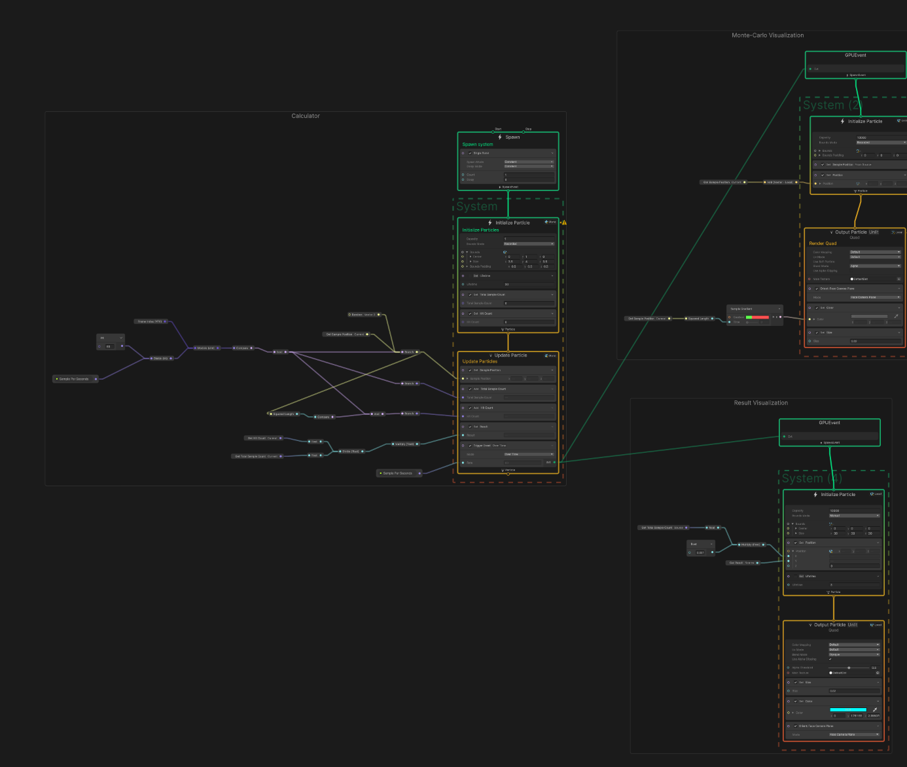

# Unity VFX Graph-only Pi Calculator

## About

A Unity VFX Graph playground for calculating π using the Monte Carlo method.

https://github.com/user-attachments/assets/55734074-bc99-4888-b446-95b96bed4706

This calculator is implemented entirely in VFX Graph, without using C# scripts, Visual Scripting, or compute shaders.

## Tested Environments

- Windows 11 Home
- Unity 6000.6.0f1
- Visual Effect Graph 17.6.0

## Install & Usage

Open `/Assets/App/Main.unity` and just play.

## Author

[@drumath2237](https://x.com/ninisan_drumath)
